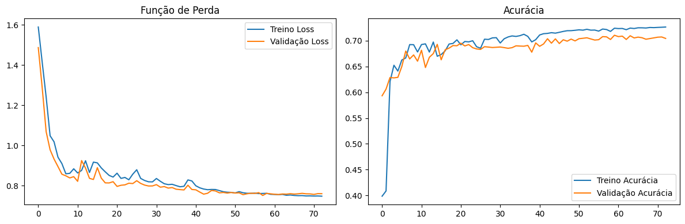
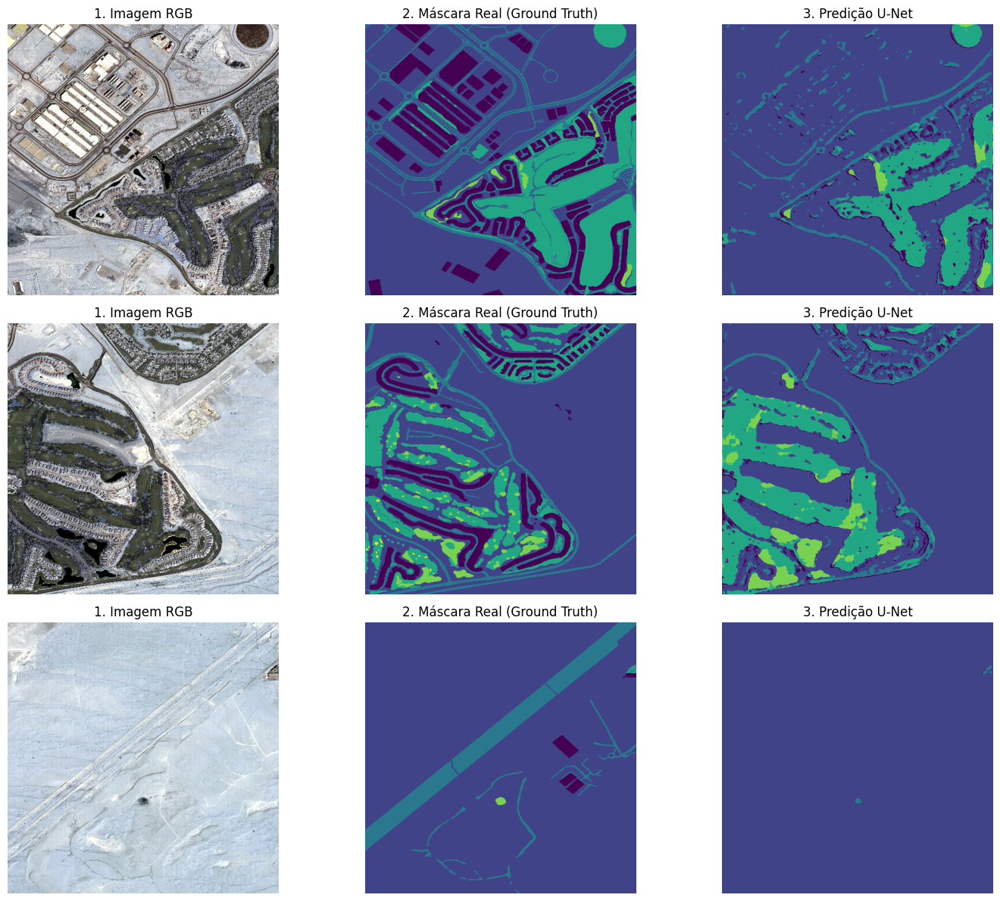
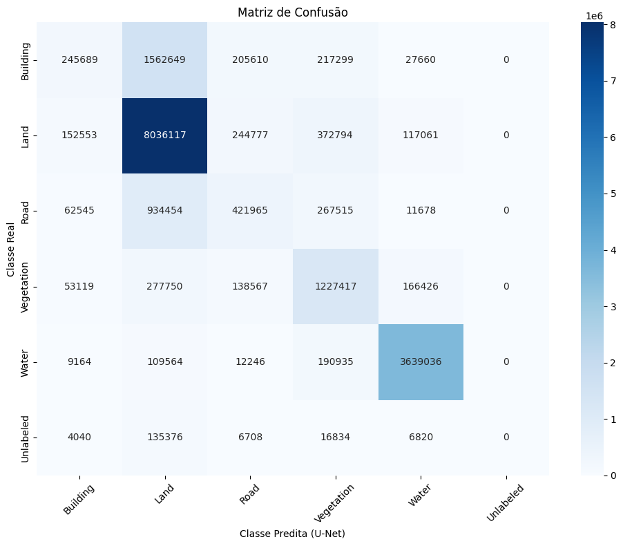
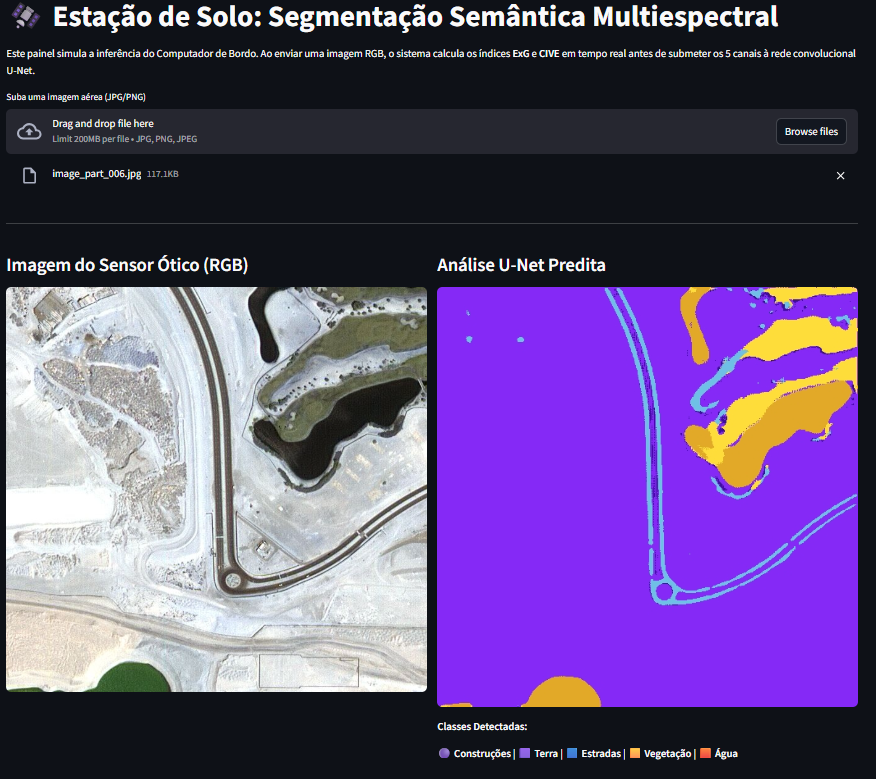

# 🛰️ Segmentação Semântica Multiespectral On-Board

Este projeto é uma Prova de Conceito (PoC) desenvolvida para o subsistema de **Imageamento Remoto e Processamento de Payload** do nanossatélite PotyraSat. O objetivo é realizar a inferência de segmentação semântica de terreno *em órbita* (Edge AI), reduzindo a necessidade de transmitir grandes pacotes de dados brutos para a estação de solo através de links de rádio limitados.

## Contextualização do Problema

Redes Neurais Convolucionais (CNNs) treinadas exclusivamente com o espectro visível (RGB) podem sofrer de **confusão espectral** ao diferenciar classes compostas por assinaturas visuais semelhantes (ex: asfalto vs. concreto vs. terra).

Para contornar essa limitação sem adicionar redes exaustivamente profundas que estourariam o limite de RAM de um Computador de Bordo (OBC), este projeto funde **Sensoriamento Remoto e Deep Learning** para testar configrações de modelo para no fim implantar na computação de borda, usando:
1. **Engenharia de Atributos:** Ao invés de usar tensor RGB de 3 canais, foi usado um tensor de 5 canais, calculando em *runtime* os índices espectrais **ExG (Excess Green)** e **CIVE (Color Index of Vegetation Extraction)**.
2. **U-Net:** A rede recebe, por exemplo, a assinatura da clorofila já matematicamente isolada, acelerando a convergência e o poder de generalização estrutural.

## Arquitetura
* **Mapeamento de Classes:** Conversão das máscaras Hexadecimais originais (Dataset de Dubai) em *One-Hot Encodings* categóricos mutuamente excludentes (6 classes).
* **Pipeline `tf.data`:** Processamento multithread com `AUTOTUNE`, aplicando *Data Augmentation* estocástico no conjunto de treino para forçar a invariância rotacional.
* **Testagem em tempo real:** Usando o Streamlit para fazer o modelo predizer uma nova imagem.

## Resultados e Limitações
Acurácia ao longo do treinamento:

<div align="center">
  
</div>

Comparando o real com a predição:

<div align="center">
  
</div>


Matriz de Confusão:
<div align="center">
  
</div>


A partir desses resultados, pode-se perceber que:
* **Houve Sucesso em Macro-Estruturas:** O contraste forçado pelos canais ExG e CIVE ajudou o modelo a isolar de maneira robusta água e vegetação densa.
* **Limitação Física (Downsampling):** O *trade-off* computacional exigiu o achatamento da resolução ótica para 512x512 pixels. Como resultado, micro-estruturas da malha urbana (vias finas e limites prediais) sofrem esmagamento na matriz convolucional, gerando difusão nas bordas inferidas.
* **Persiste confusão com algumas classes:** Com a configuração da modelo atual, existem ainda algumas classes que ele não consegue diferenciar bem, optando por "chutar" "terra" para construções e estradas.


## Como Executar o Simulador da Estação Solo

Foi desenvolvida uma interface **Streamlit** que simula a telemetria visual, processando imagens brutas em tempo real através da rede neural pré-treinada.

1. **Clone o repositório:**
   ```bash
   git clone https://github.com/seu-usuario/potyrasat-vision.git
   cd potyrasat-vision
   ```
2. **Instale as dependências:**
    ```Bash
    pip install -r requirements.txt
    ```
3. **Execute a aplicação Streamlit:**
    ```Bash
    streamlit run app.py
    ```
4. **Demonstração:**

<div align="center">
  
</div>

## 🔭 Próximos Passos
* Integração NIR: Atualizar o feature engineering com os cálculos do verdadeiro NDVI, utilizando canais de Infravermelho Próximo (NIR) a serem capturados pelo hardware de voo real.

* Melhorar arquitetura do sistema de inferência

* Quantização (TFLite): Reduzir a precisão dos pesos do modelo para Float16 ou INT8, validando a latência de inferência embarcada diretamente nos microcontroladores do payload.4
